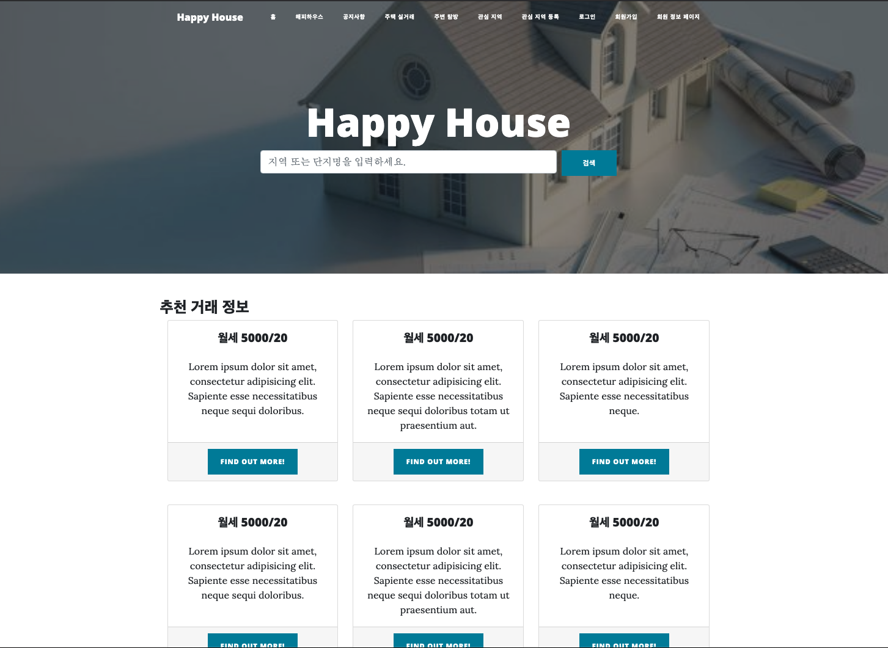
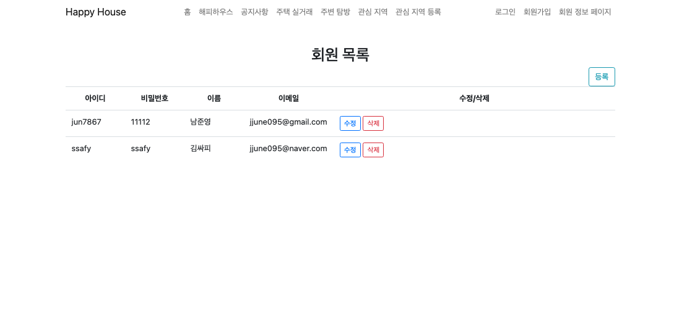
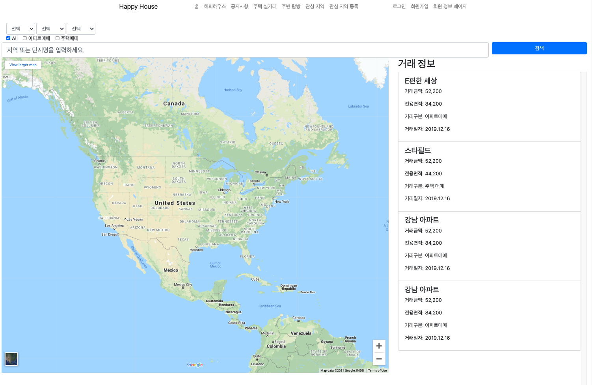
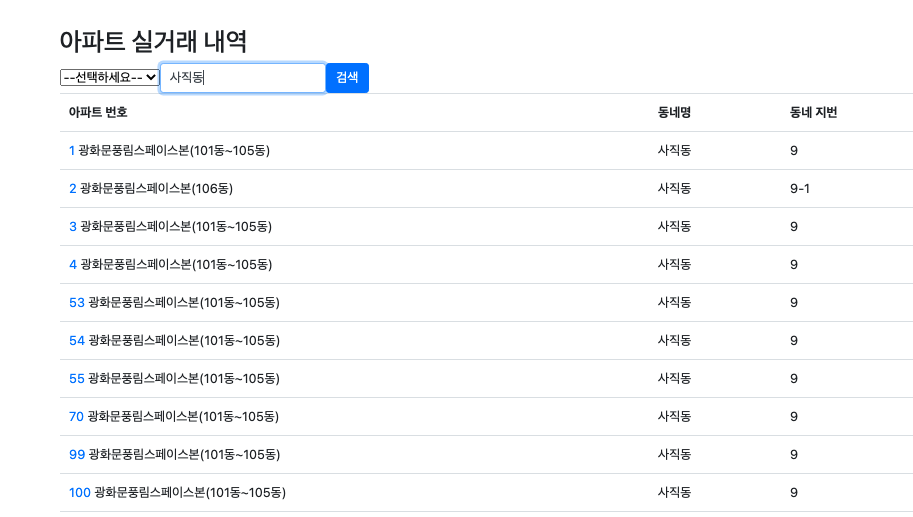
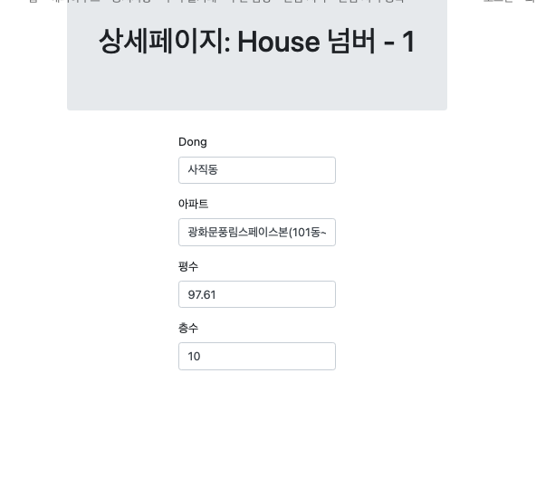

관통 프로젝트 제출 방법

# 관통프로젝트: HappyHouse_Spring_서울_08반_남준영_박호현
### 제출일: 2021. 05. 07

### 참여 페어
- 남준영(조장), 박호현 

### 처리된 요구사항 목록
  
|난이도|구현기능|세부|작성여부(O/X)|
|:---:|---|---|:---:|
|기본|메인페이지||O|
|기본|회원관리페이지|회원정보 등록화면|O|
|기본|회원관리페이지|회원정보 수정화면|O|
|기본|회원관리페이지|회원정보 삭제화면|O|
|기본|회원관리페이지|회원정보 검색화면|O|
|기본|로그인/로그아웃 페이지||O|
|기본|아파트 실거래가 검색,결과 페이지|전체검색화면|O|
|기본|아파트 실거래가 검색,결과 페이지|상세검색화면|O|
|기본|아파트 실거래가 검색,결과 페이지|동별화면|O|
|기본|아파트 실거래가 검색,결과 페이지|아파트별검색화면|O|
|추가||비밀번호찾기/사이트맵/메뉴구성|X|
|추가|관심지역 동네 업종 정보||X|
|추가|관심지역 대기 오염 정보||X|
|심화||웹사이트 소개|X|
|심화||공지사항|X|

* 작성된 기능은 반드시 캡쳐되어야 합니다. 
* 추가로 구현한 기능을 표에 추가시키세요.

### 실행화면 캡쳐 - 
TODO: 요구사항 목록에서 완료 처리된 사항의 캡쳐 이미지를 등록하세요.
구현 기능: 메인 페이지

구현 기능: 회원 관리 페이지

구현 기능: 아파트 실 거래가 페이지

구현 기능: 동/ 아파트 검색 페이지

구현 기능: 아파트 상세 페이지 

